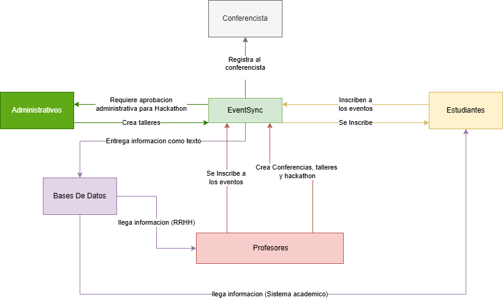
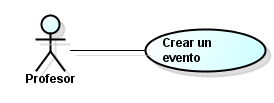
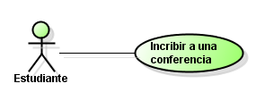

# DOSW_ParcialT1_CristianGonzalez

### Autor : Cristian Jose Gonzalez Rodriguez

## Puntos Del Parcial

## 1. Realice el diagrama de contexto con las generalidades de su sistema.

## 2. Identifique 2 patrones de diseño que puedan aplicarse al caso de estudio,  especificando por cada uno:

## Patron1.

a. Nombre del Patrón

Patron a usar es Abstract Factory

b. Tipo de patrón (creacional, estructural o de comportamiento).

Este es un patron Creacional

c. Justificación de la decisión.

Decidi usar este patron creacional ya que nos permite producir familias de objetos relacionados sin especificar sus clases concretas.

En este caso tenemos todos los tipos de evento y reglas, cada una con sus diferencias pero cuentan con la misma estructura, lo mismo pasa con los usuarios, son estudiantes, profesores y administratuvos pero cuentan con nombre, correo y otros atributos y metodos similares.

Con esto en mente, es la mejor opcion ya que creamos clases abstractas que tendran lo que tienen en comun y cada clase aparte se hace cargo de saber implementarlas  a su necesidad.

## Patron2.

a. Nombre del Patrón

Patron a usar es Observer

b. Tipo de patrón (creacional, estructural o de comportamiento).

Este es un patron de comportamiento

c. Justificación de la decisión.

Decidi usar este patron creacional ya que nos permite definir un mecanismo de suscripción para notificar a varios objetos sobre cualquier evento que le suceda al objeto que están observando.

En este caso todos los usuarios estan observando al notificador o pulicador que es el encagado de decir cuando se genera un evento nuevo, bien sea una conferencia, taller o hackaton

## 3. Identifique 5 requerimientos del sistema y clasifíquelos en funcionales  y no funcionales. Garantiza que al menos un requerimiento funcional seleccionado utilice un patrón identificado. 

Requerimientos del sistema:

Funcionales: 
* Crear eventos segun el tipo a usar. **Aca se aplica el patron de Abstract Factory ya que cada evento cumple con ciertos criteorios que otros no**

* Registrar inscripciones. 

* Notificar a los incritos los cambios relevante en el evento. 

No Funcionales:
* Generar informes que cuenten con el logo de la institucion

* Checkear el formato de las reglas de correos, ya que solo permite el  @mail.escuelaing.edu.co

## 4. Del listado anterior, seleccione los 2 requerimientos funcionales más importantes del sistema y desarrolle un diagrama de casos de uso con su respectiva historia de usuario. Garantiza que al menos un requerimiento funcional seleccionado utilice un patrón identificado.

Caso de uso 1.

Como: Profesor

Quiero: Crear un evento

Para Poder: Generar mas eventos academicos del campus(conferencias, talleres y hackathons) ayudando a los estudiantes en su formacion academica
**Este tiene implementado el patron de diseño Abstract Factory ya que cada Evento es diferente entre si, pero comparten similitudes que heredaran de una clase abstracta**

Caso de uso 2.

Como: Estudiante

Quiero: Inscribirme a una Conferencia

Para Poder: Participar activamente y adquir mayor conocimiento sobre el tema o aprender cosas nuevas.

## 5. Especifique los 2 requerimientos funcionales seleccionados en el punto anterior . (Añadir los documentos al repositorio, en la carpeta de requerimientos).

Se encuentra en (docs/requirements/requirements.md)

## 6. Seleccione un requerimiento asociado al patrón y realice la descomposición de tareas asociadas: Épica - Historia de Usuario - Al menos 3 tareas.

### 1. Épica:

| Campo | Descripción |
|------|-------------|
| **ID** | EP-01 |
| **Título** | Crear eventos por cada tipo (conferencias, talleres y hackathons) |
| **Descripción** | *Es necesaria esta epica ya que es el corazon de la app, porque nos permite crear los eventos academicos del campus (conferencias, talleres y hackathons) * |
| **Stakeholder** | *Administrativos, Profesores y Estudiantes* |

### 2. Historias de usuario:

| Campo | Descripción |
|------|-------------|
| **ID** | HU-01 |
| **Título** | Crear un evento de tipo Conferencia|
| **Descripción** | *Como [Profesor] quiero [Crear un evento de tipo conferencia] para [que los estudiantes conozcan mas acerca de algun tema en especifico o aprendan nuevos temas que podrian ser de su interes]* |
| **Prioridad** | *[Alta]* |
| **Estimación** | *5* |

### 3. Tareas:

| Campo | Descripción |
|------|-------------|
| **ID** | TR-01 |
| **Título** | Buscar tema de interes para crear una conferencia|
| **ID de la Historia de Uso asociada** | HU-01 |
| **Descripción** | *Como [Profesor] quiero [Buscar tema de interes para crear una conferencia] para [que los estudiantes se encuentren atraidos por el tema y asistan a la conferencia]* |
| **Tareas requisito** | *No Aplica* |

| Campo | Descripción |
|------|-------------|
| **ID** | TR-02 |
| **Título** | Buscar conferencista que sepa del tema |
| **ID de la Historia de Uso asociada** | HU-01 |
| **Descripción** | *Como [Profesor] quiero [Buscar conferencista que sepa del tema] para [que las charlas sean mucho mas entretenidas, dinamicas y cautivadora ya que una persona que tiene dominio del tema o estudios relacionados a este puede enseñarlo de forma clara y simple]* |
| **Tareas requisito** | *TR-01* |

| Campo | Descripción |
|------|-------------|
| **ID** | TR-03 |
| **Título** | Revisar horas, horarios de estudiantes y profesores  |
| **ID de la Historia de Uso asociada** | HU-01 |
| **Descripción** | *Como [Profesor] quiero [Revisar horas, horarios de estudiantes y profesores] para [que pueda asistir la mayor cantidad de gente al evento y acomodar la hora del conferencista]* |
| **Tareas requisito** | *TR-02* |

## 7. Realice un diagrama de clases que permita entender su solución. Mencione, ¿cuáles principios SOLID está aplicando? ¿Y por qué?

En este caso tenemos principios como:

S: cada clase se hace cargo de sus tareas y resposabilidades.

O: Es facil de extender a mas eventos.

I: Es mejor tener mas cantidad de interfaces que una clase que tenga muchas.

